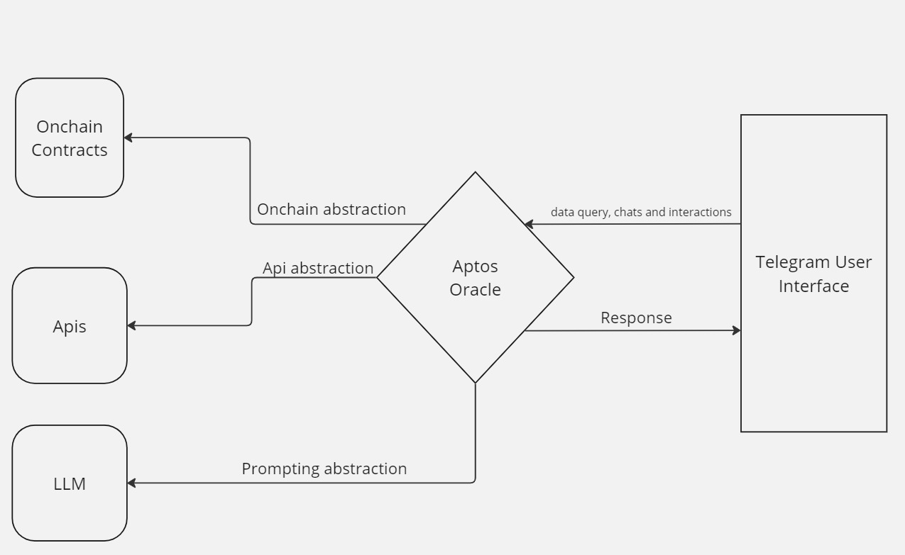

# Aptos Oracle Documentation

## Contents

### 1. Introduction
### 2. Features
### 3. Supports
### 4. Technical Details
### 5. Conclusion
### 6. Contacts

# Introduction

Hello there😀! I know the name Aptos Oracle makes you curious with some questions such as; what does this project do? Why is it built with rust? It is a blockchain oracle? or whatsoever you may have in your mind. Don't worry, you will have a good comprehensive understanding of aptos oracle.

***Aptos oracle*** is a AI powered rust agent specialized for aptos blockchain. I know you must have heard about similar agent in other web2 projects built with python and other languages. However, what makes Aptos Oracle special? ***Aptos Oracle*** is built with ***rust.*** 

***READER:*** Well🤷‍♂️, why using rust to build it, when you can do the same with python or any other language that has more telegram and onchain related supports. It's an hackathon project afterall?

***Project Owner:*** You are right😅, building with python would be more quicker and less stressful, after all, python has lots of documentations and library support. However, python AI agent isn't prepared to scale across various aptos project. Aptos blockchain is currently scaling. Aptos official telegram group has over 110,000 members. Other aptos based project present on telegram has thousands of members. building this powerful social learning and trading based tool with python will be good for hackathon but not production ready to service the growing demands of various aptos communities.

***READER:*** Wow😻! That will be great. building this project with low latency programming language like rust is actually a good choice. Aptos blockchain is all about scaling, so we scale with aptos😹😹! Let's see the awesome features it has to offer🤠!

***Project Owner:*** We scale📡📡📡🦅😊😊👇👇👇👇!

# Features

Now this is where things gets interesting🙂! Every feature is this project is implemented based on user story and community usecase.

They are three main features in this project; this features are:

| FEATURE      | DESCRIPTION | DEVELOPMENT STATUS |
| ------------ | ----------- | ----------------- |
| 1. AI agent    |This is a LLM promptly customized and configrued to provide information based on aptos blockchain to users | Completed |
| 2. Onchain Data Provider      | This is a crypto indexer api used to provide latest onchain data to users such as *token price data*,*NFT price data*,*token supply data* and *more* | pending... |
| 3. Trading Bot       | This is a trading bot enabling users to take orders, buy, sell and swap tokens on aptos blockchain through the interface. It's also intend to carry out cross chain operations in future. | pending...|

### AI Agent
With the rise of aptos blockchain, onboarding new users to the ecosystem is currently challenging. Setting up technical and non-technical bootcamps can be resource intensive. Also, this training time seasonal. Although carrying out this activities is a good practice to grow the ecosystem, thousands of users are left out and millions of potential users. According to statistics, ***There are over 1billion users in telegram***. Guess what😎? No crypto project is leveraging this specialized agents to educate users and help them navigate through the their blockchains. We just solved more than half the problem of ***non-technical Aptos Blockchain Education***. Also, this AI agent can be integrated and added to different aptos blockchain related groups to interact with community by answering different question dynamically based on Aptos Blockchain. Admin and moderators will no longer burnout due to overwhelming questions from users. Hurray🤸‍♀️🤸‍♂️!!

### Onchain Data Provider Feature
coming soon...

### Trading bot Feature
comming soon...

Time to see supports😎!

# Supports
Regarding supports, this project is ready to support all aptos based projects in coming future. However, we seek supports from different API services and trading services in the aptos ecosystem. Due to the huge skill gap in rust, we haven't seen a supported rust SDK in aptos blockchain. We intend to collaborate and help projects ready to build onchain adapters and SDKs for rust so that we can create a safe ontrade system.

# Technical Details 

### Architectural Design Overview of Aptos Oracle 

### Testing the application locally

# Conclusion
In summary, Aptos Oracle is an AI powered rust bot leveraging the power of Rust and AI to solve majorly educational and awareness problem in aptos blockchain. It also intend to leverage users to trade and interact with aptos blockchain through telegram chat interface which is a simple, understandable and easily used interface across different blockchain and projects. This strategy will lower the barrier for users onboarding to aptos blockchain benefitting the ecosystem in a whole.

## Presentation File

[Download File](./public/AptosOracle.pdf)

# Contacts

1. [Twitter](https://x.com/EkomUkanga)
2. [Telegram](https://t.me/Ekomart)
3. [Linkedin](https://www.linkedin.com/in/ekomabasi-ukanga-aaa72a225/)

